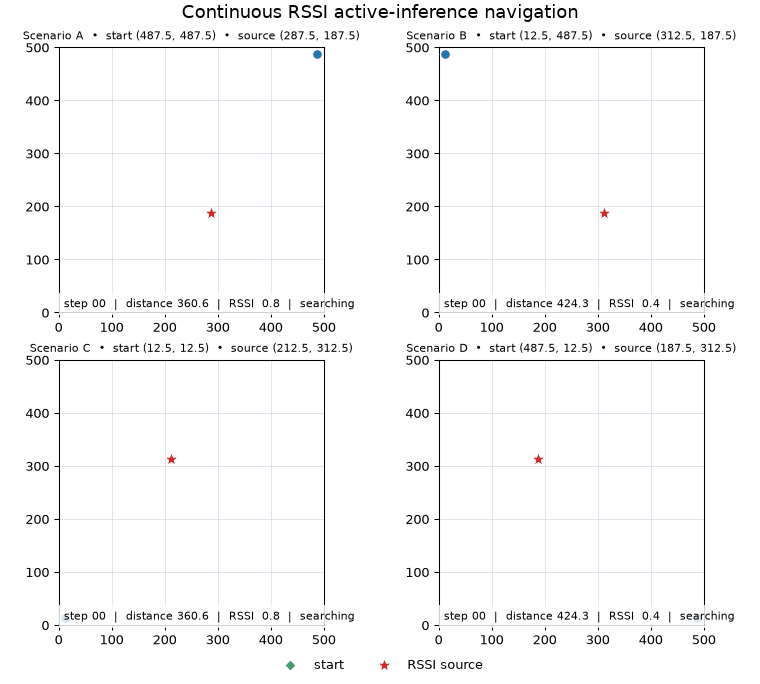

# Active-Inference Navigation Agent

[](https://github.com/Diluna98/active-inference-navigation-agent/actions/workflows/ci.yml)
[](LICENSE)

A continuous-observation active-inference agent that navigates toward an
unknown radio-frequency source using position and RSSI measurements. The agent
is built with [PyAIF](https://github.com/Diluna98/python_active_inference).



The animation shows four deterministic navigation episodes. Each agent starts
at a different position and searches for a different RSSI source. The panels
display the travelled path, source distance, received signal strength, and
completion status.

## Overview

The environment provides a continuous observation at every time step:

```text
observation = [x position, y position, RSSI]
```

The generative model represents three categorical hidden-state factors:

```text
state = [x cell, y cell, source cell]
```

The agent updates its beliefs about its current position and the unknown source
location, evaluates candidate movement policies, and selects actions that are
expected to produce preferred high-strength RSSI observations.

The implementation supports:

- Continuous Gaussian likelihoods for position and RSSI
- Discrete spatial hidden states
- Cardinal movement policies on a bounded grid
- Shallow state and policy inference
- Deep temporal inference over multi-step policies
- Deterministic, reproducible simulation scenarios
- Optional parallel policy evaluation through PyAIF
- Replaceable simulation and ROS 2 sensor/actuator adapters
- Typed YAML configuration for arena, topics, sensors, and motion control

## Architecture

The Active Inference core does not import ROS, TurtleBot, Bluetooth, or the
simulator. Runtime dependencies point inward toward a small hardware-independent
API:

```text
ObservationSource -> NavigationRuntime -> ActionExecutor
                           |
                    Active Inference
                           |
                  TerminationCondition
```

`Observation` contains `x`, `y`, and `rssi`. `NavigationAction` contains an
`AxisAction` for x and y. The five public actions are stay, negative/positive x,
and negative/positive y. The agent evaluates joint cardinal policies, so robot
rotation is never part of its action space.

To use another sensor, implement `ObservationSource.read_observation()`. To use
another robot, implement `ActionExecutor.execute()` and
`wait_for_completion()`. Neither change requires editing the agent or runtime.

`NavigationRuntime` performs the common loop: read, infer, select, validate,
execute, wait, read the resulting measurement, and check termination.

## Installation

Clone the repository and install it in a virtual environment:

```bash
git clone https://github.com/Diluna98/active-inference-navigation-agent.git
cd active-inference-navigation-agent
python -m venv .venv
python -m pip install -e .
```

Version 0.2.0 release notes are available in
[`CHANGELOG.md`](CHANGELOG.md).

Install the development tools when running tests or building distributions:

```bash
python -m pip install -e ".[dev]"
```

## Command-line usage

Run a shallow-inference episode:

```bash
active-inference-navigate --seed 7 --planning-windows 20
```

Run deep temporal inference with a three-step horizon:

```bash
active-inference-navigate \
  --seed 7 \
  --temporal-horizon 3 \
  --goal-resolution 2 \
  --planning-windows 8 \
  --policy-samples 300
```

The command reports the initial, minimum, and final source distances together
with the number of movements and completion status.

## Python API

```python
from active_inference_navigation import (
    GridNavigationEnvironment,
    NavigationAgentConfig,
    run_navigation_episode,
)

config = NavigationAgentConfig(
    model_size=20,
    goal_resolution=10,
    temporal_horizon=1,
    random_seed=7,
)
environment = GridNavigationEnvironment(
    start=(487.5, 487.5),
    goal=(212.5, 312.5),
    random_seed=7,
)

result = run_navigation_episode(
    config=config,
    environment=environment,
    planning_windows=20,
)

print(result.positions)
print(result.distances)
print(result.reached_goal)
```

Set `temporal_horizon=1` for shallow inference. Values greater than one enable
deep temporal inference.

`run_navigation_episode()` remains the compatibility entry point for simulation.
Internally it now composes `SimulationObservationSource`,
`SimulationActionExecutor`, and `NavigationRuntime`.

## Real-world ROS 2 usage

The initial ROS adapter combines:

- `nav_msgs/msg/Odometry` on `/tb4_08/odom`
- `std_msgs/msg/Float32` on `/tb4_08/rssi`
- `geometry_msgs/msg/Twist` on `/tb4_08/cmd_vel`

With ROS 2 sourced and this package installed, run:

```bash
active-inference-navigation-ros \
  --planning-windows 20
```

The installed command uses its packaged default configuration. Pass
`--config /path/to/navigation.yaml` to use an experiment-specific copy.

The observation adapter stores current x/y and a configurable median window of
RSSI samples. Missing or stale odometry/RSSI raises a clear observation error.

The TurtleBot executor converts a grid step to the configured cell displacement
(0.35 m with the default 7 m, 20 by 20 arena). It uses odometry to rotate
toward the neighboring cell, drives to the target with closed-loop correction,
and publishes a zero `Twist` at phase changes, completion, failure, and
shutdown. It does not use Nav2 or SLAM.

The ROS Python packages are supplied by the ROS installation and intentionally
are not imported when using the simulator or core library.

Before autonomous navigation, execute one explicit action through the production
closed-loop actuator:

```bash
active-inference-actuator-test \
  --config config/navigation.yaml \
  --action positive_x
```

The command waits for odometry, prints the start and finish poses, executes only
the requested grid action, and publishes zero velocity on completion or error.
With the default 7 m, 20 by 20 setup, `positive_x` moves 0.35 m.

After a trial, preview a deterministic odometry-only path back to the configured
`experiment.start_column` and `experiment.start_row`:

```bash
active-inference-return-home \
  --config config/navigation.yaml \
  --dry-run
```

If the printed path is clear, execute it by omitting `--dry-run`:

```bash
active-inference-return-home --config config/navigation.yaml
```

Return-home does not read RSSI or invoke Active Inference. It calculates an
x-then-y Manhattan path and executes each cardinal action using the same
closed-loop, transformed-frame actuator.

To collect a new distance/RSSI calibration with interactive one-cell movements,
run:

```bash
active-inference-rssi-collect \
  --config config/navigation.yaml \
  --source-x 2.975 \
  --source-y 4.375 \
  --output rssi_calibration_raw.csv \
  --samples-per-location 100
```

The source coordinates are continuous arena coordinates in metres. The
collector transforms odometry using the configured arena frame, calculates the
horizontal distance to the known BLE source, and saves every accepted raw RSSI
packet to CSV. After collecting the requested number of samples, it accepts
`up`, `down`, `left`, or `right` for a one-cell movement, or an absolute target
such as `(8,12)`. Absolute targets use a validated x-then-y Manhattan path.
Every step uses the closed-loop TurtleBot actuator, restores
`motion.final_heading`, and respects grid boundaries. The next batch starts
after arrival. The default final heading is arena positive x. Collection pauses
automatically while the robot moves, before settling completes, when the
heading is outside tolerance, or when odometry is stale. Enter `q` or press
Ctrl+C to finish. Use `--required-heading any` only when deliberately measuring
antenna-orientation effects.

Real navigation stops early when the configured termination condition is met:

```yaml
termination:
  provider: persistent_rssi
  rssi_threshold: -62.0
  consecutive_observations: 3
```

The counter uses the already median-aggregated RSSI observation. A reading below
the threshold resets it. The `--planning-windows` limit remains a maximum-action
safety bound when the persistent goal condition is not reached.

## Configuration

Edit `config/navigation.yaml` to change:

- Grid rows/columns, arena width/height, and coordinate origin
- Goal/source-state resolution and Active Inference computation settings
- Odometry, RSSI, and velocity topic names
- RSSI median window and sensor freshness timeouts
- Linear/angular speeds, position/yaw tolerances, control period, and timeout
- Likelihood provider

`GridGeometry` is the single source for metric/grid conversion and boundary
checks. Rectangular grids and arenas are supported. The built-in
simulation `rssi_navigation` likelihood and real-world `calibrated_dbm`
likelihood are kept separate from sensor adapters.

The supplied real-world configuration selects `calibrated_dbm`. Its initial
parameters were fitted from measurements between 1.0 m and 8.6 m using the same
five-sample median aggregation as the runtime. See
[`docs/rssi_calibration.md`](docs/rssi_calibration.md) for the fitted model,
uncertainty, and extrapolation limits.

The `active_inference` YAML section explicitly configures goal resolution,
temporal horizon, message-passing iterations, policy sampling, reproducibility,
and worker count. With the default 7 m arena and `goal_resolution: 10`, the
source belief is a 10 by 10 grid whose cells are 0.7 m wide. This is independent
of the 20 by 20 movement grid and its 0.35 m cells.

The default coordinate convention places `(0, 0)` at the arena's lower-left
boundary. Grid indices are zero-based, and grid-to-metric conversion returns
cell centres.

For the supplied real-world setup, raw odometry is reset to `(0, 0)` while the
robot is physically at the centre of grid cell `(0,0)`. `ArenaFrameTransform`
then maps raw odometry into continuous arena coordinates. The supplied mapping
uses arena +x = odometry -y and arena +y = odometry +x, with odometry zero at
arena `(0.175, 0.175)`. The same bidirectional transform is used for sensor
observations, boundary checks, action targets, and headings.

## Compatibility and behavior changes

The existing `GridNavigationEnvironment`, `NavigationAgentConfig`,
`NavigationEpisodeResult`, `build_navigation_agent()`, and
`run_navigation_episode()` APIs remain exported.

Diagonal actions previously slipped through shallow factorised action selection
and `environment.step()`. The agent now uses the five joint cardinal policies,
and the environment/runtime reject diagonal input defensively. Consequently,
saved trajectories and the number of steps needed to reach a source can differ
from version 0.1.0.

## Recreate the animation

Generate the four-scenario GIF:

```bash
active-inference-navigation-gif
```

The animation is written to:

```text
docs/results/active_inference_navigation.gif
```

## Project structure

```text
active-inference-navigation-agent/
├── src/active_inference_navigation/
│   ├── agent.py
│   ├── animation.py
│   ├── cli.py
│   ├── environment.py
│   ├── likelihoods.py
│   └── simulation.py
├── tests/
├── docs/results/
├── pyproject.toml
└── LICENSE
```

## Development

Run the quality checks locally:

```bash
ruff check .
pytest -q
python -m build
```

GitHub Actions runs linting, tests, and distribution builds on Python 3.10 and
3.11.

## License

This project is available under the [MIT License](LICENSE).

Copyright © 2026 Diluna A. Warnakulasuriya.
